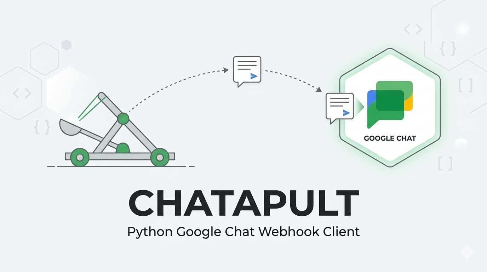

# Chatapult

A fast, Pythonic API wrapper for Google Chat webhooks.

Chatapult is designed to make sending automated notifications, CI/CD alerts, and rich UI cards to Google Workspace Spaces effortless. Whether you need a simple synchronous alert or a high-throughput async notification integration, Chatapult handles the boilerplate so you can focus on your application.

## Features

* **Zero Boilerplate:** Send a message to a Google Chat Space in three lines of code.
* **Async Ready:** First-class support for `asyncio`, making it perfect for FastAPI, Discord bots, and high-concurrency event loops.
* **Rich V2 Cards (Coming Soon):** Construct complex Google Chat Cards and Widgets using clean Python objects instead of nested JSON.
* **Threaded Replies:** Easily group related alerts by replying to specific message threads.
* **Fully Typed:** Built with standard Python type hints for excellent IDE autocomplete and static checking.

## Installation

Install via pip:

```bash
pip install chatapult
```

## Quick Start

**Security Note:** Never hardcode your webhook URLs. Always load them securely from environment variables or a secrets manager.

### Synchronous Usage

Perfect for simple scripts, cron jobs, or basic data pipelines.

```python
CODE HERE
```

### Asynchronous Usage

Ideal for web servers, async task queues, or applications where you cannot block the main thread.

```python
CODE HERE
```

### Advanced Usage

Documentation for sending V2 Cards, threaded replies, and handling rate-limit exceptions will be added here as features are released.

## Contributing
Contributions are welcome! If you'd like to help improve Chatapult, please review our [Contributing Guidelines](CONTRIBUTING.md) and open an issue or pull request.

## License

This project is licensed under the MIT License - see [LICENSE](LICENSE) for details.
